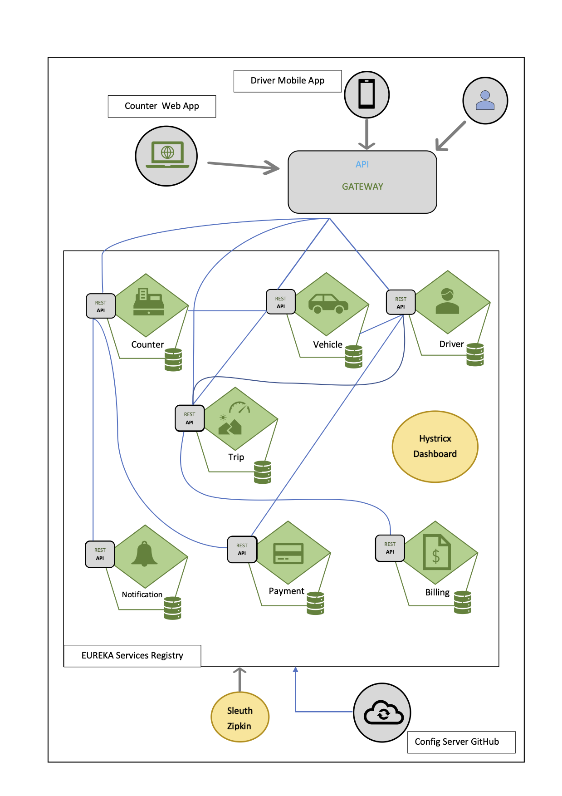

<h3 align="center">:rotating_light: :construction:&ensp;&ensp;Work In Progress&ensp;&ensp;:construction: :rotating_light:</h3>
<h1 align="center">Highway Ticketing Automation for MTC LP</h1>

> LP Training code base that belongs to my office work. &ensp;:boat: :boat:

<h2>License</h2>

> Licenses this source under the <u>MIT License</u>,You may not use this file except in compliance with the License.
<!-- Badges -->
<p align="left">
  <a href="LICENSE.md">
    
  </a>
</p>

<h2>Content&ensp;&ensp;:book: :book:</h2>

<ul>
    <li>Lp-highway-ticketing-automation-mtc-backend</li>
      ```
        Java
        Maven
        Spring
      ```
    <li>Lp-highway-ticketing-automation-mtc-web-app</li>
     ```
        Angular 10
        Node
     ```
    <li>Lp-highway-ticketing-automation-mtc-mobile-app</li>
    <li>Lp-highway-ticketing-automation-cloud-config-store</li>
</ul>

[](http://stackoverflow.com/questions/tagged/maven)


  <a>
    
  </a>
 <a>
  
 </a>


<h4 align="center">Here is a screenshot of the System architecture design</h4>
<!-- image -->

